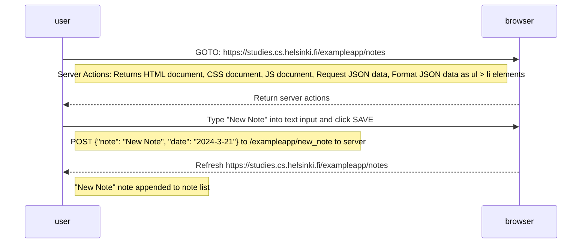

```mermaid
sequenceDiagram
	participant user
	participant browser

	user->>browser: GOTO: https://studies.cs.helsinki.fi/exampleapp/notes
	Note right of user: Server Actions: Returns HTML document, CSS document, JS document, Request JSON data, Format JSON data as ul > li elements
    browser-->>user: Return server actions
	user->>browser: Type "New Note" into text input and click SAVE
	Note right of user: POST {"note": "New Note", "date": "2024-3-21"} to /exampleapp/new_note to server
	browser-->>user: Refresh https://studies.cs.helsinki.fi/exampleapp/notes
	Note right of user: "New Note" note appended to note list
```
