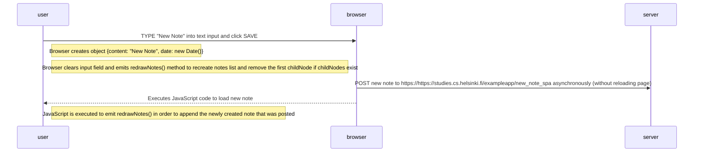

```mermaid
sequenceDiagram
    participant user
    participant browser
    participant server

    user->>browser: TYPE "New Note" into text input and click SAVE
    Note right of user: Browser creates object {content: "New Note", date: new Date()}
    Note right of user: Browser clears input field and emits redrawNotes() method to recreate notes list and remove the first childNode if childNodes exist
    browser->>server: POST new note to https://https://studies.cs.helsinki.fi/exampleapp/new_note_spa asynchronously (without reloading page)
    browser-->>user: Executes JavaScript code to load new note
    Note right of user: JavaScript is executed to emit redrawNotes() in order to append the newly created note that was posted
```
